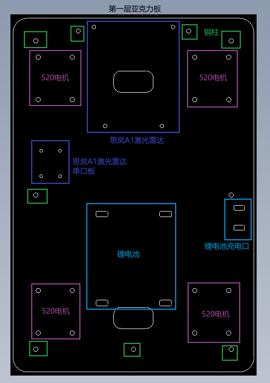
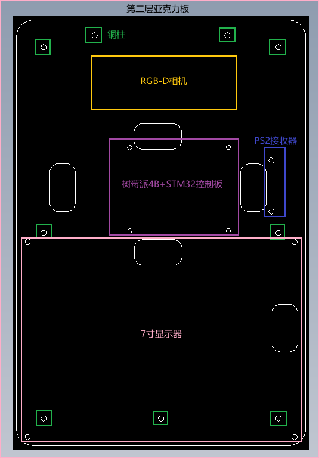
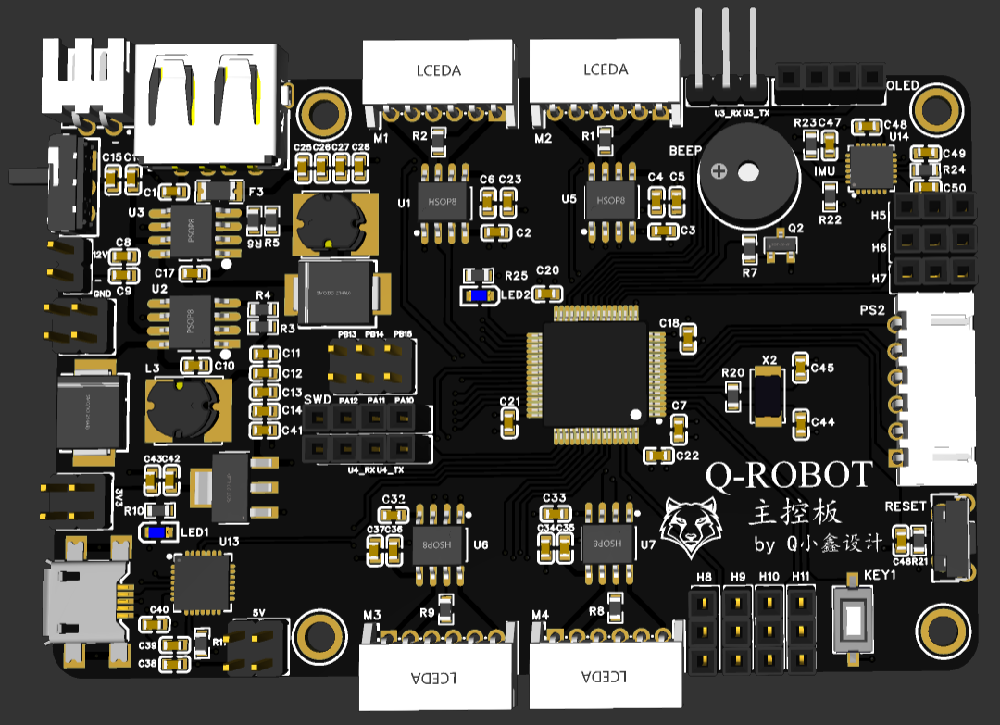

# SLAMCarProject
### 本项目为我设计的移动SLAM机器人，命名为： Q-Robot

- 机器人底盘控制器：**STM32F103RCT6**
- 上层控制器：**树莓派4B**
- 传感器：
  - 思岚A1激光雷达
  - Orbbec Astra Pro RGB-D相机
  - 高精度9轴惯导模块N100
  - PS2遥控器
- 软件：
  - STM32CubeMX 6.7.0
  - Keil 5.29.0
  - 立创EDA
  - CAD迷你画图
  

## 一、机器人底盘（亚克力板图纸）
- 总共包括两个文件(plate->plate1.dwg/plate2.dwg)
  - 第一层亚克力板图纸（可放置520电机、锂电池、思岚A1激光雷达/串口板）
  - 第二层亚克力板图纸（可放置Orbbec Astra Pro RGB-D相机、树莓派4B、STM32控制板、PS2遥控器接收器、7寸的显示屏）

     
     第一层亚克力板图纸

     
     第二层亚克力板图纸

## 二、机器人底盘控制器原理图

     
     基于SMT32F103RCT6的控制器原理图

## 三、机器人底盘控制器PCB图

     
     基于SMT32F103RCT6的控制器PCB图

## 四、机器人底盘控制器--> STM32
- 电机控制（motor）:TIM5/TIM8
  - Motor1：TIM8_CH1/TIM8_CH2
  - Motor2：TIM5_CH3/TIM5_CH4
  - Motor3：TIM8_CH3/TIM8_CH4
  - Motor4：TIM5_CH1/TIM8_CH2
- 编码器（Encoder）：TIM1/TIM2/TIM3/TIM4
  - Encoder1:TIM1
  - Encoder2:TIM2
  - Encoder3:TIM3
  - Encoder4:TIM4
- PS2遥控器
  - PC0 ->Input    PS2_DAT
  - PC1 ->Output   PS2_COM
  - PC2 ->Output   PS2_ATT
  - PC3 ->OutPut   PS2_CLK
- 串口（UART5）
  - PD2  --> U5_RX
  - PC12 --> U5_TX
- MPU6050（IIC）
  - MPU6050_SDA：PC4
  - MPU6050_SCL：PC5

已完成情况：
- [x]  添加电机控制（PWM）相关代码
- [x]  添加编码器数据的采集以及转化为速度m/s
- [x]  添加机器人运动模型（四轮模型）运动学逆解
- [x]  添加PID控制算法（增量式） 
- [x]  添加PS2遥控器相关代码
- [x]  添加MPU6050驱动代码，可获取加速度原始值和角速度原始值
- [x]  添加将底层控制数据通过串口发送给ROS端
- [x]  新增FreeRTOS功能，后续只修改维护QRobot_FreeRTOS，基本功能和无OS版本一致，不同之处只是一些逻辑方面

